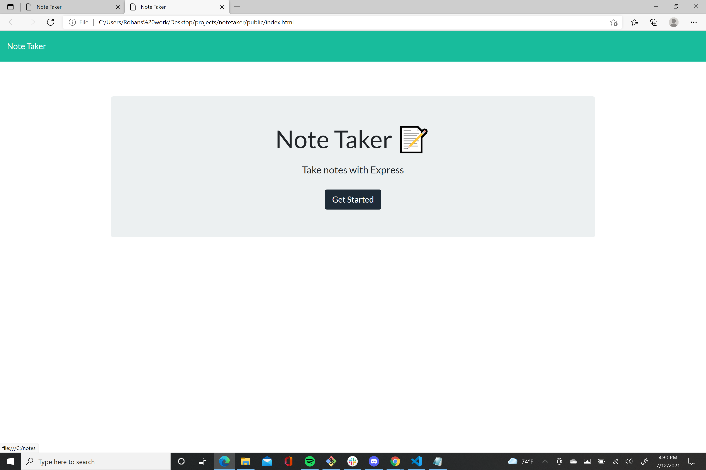
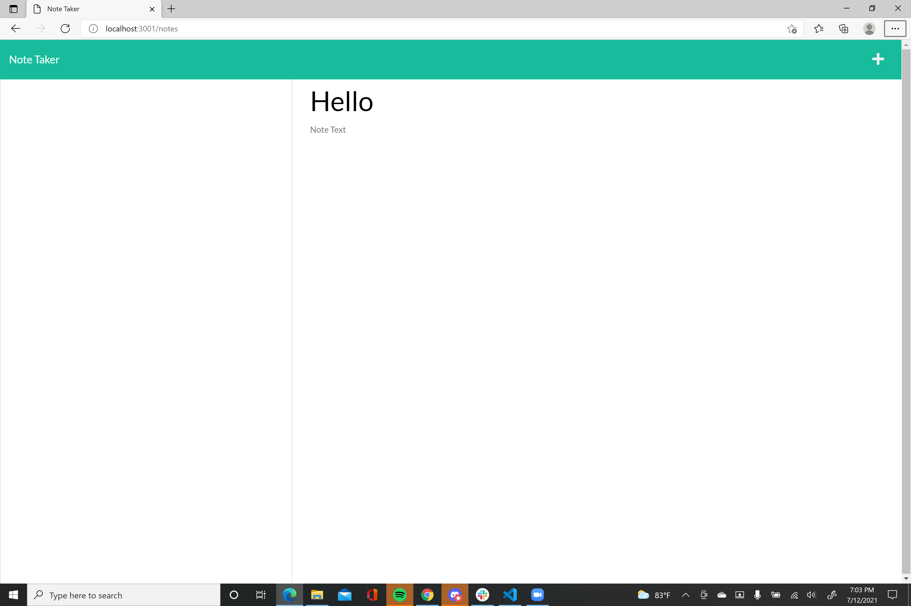
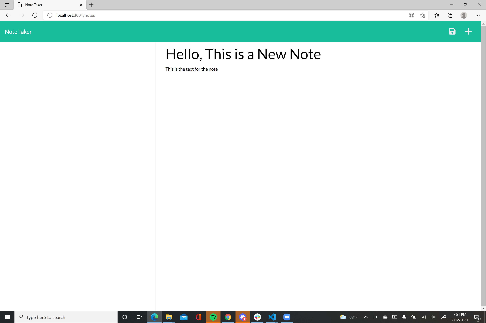

Our task was to create a application that can be used to write and save notes. This application was to be deployed to heroku.

Success- Succesfully installed packages
         Deployed to Heroku
         Correct File structure
         Can Write Notes

Needs improvement- 
Still need to create correct api routes format so that Notes could render

I also included screenshots of the landing page with the generated html page-

